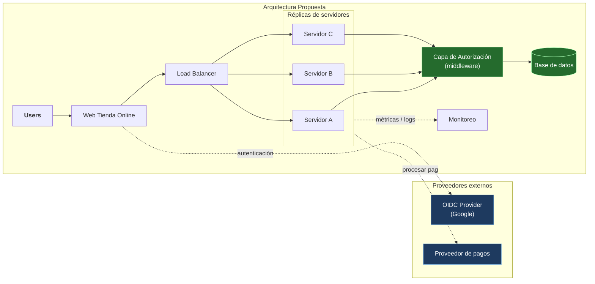

Ejercicio típico de entrevista estilo ticket de **Arquitectura de software y seguridad** para un perfil base, con respuestas y planteos modelo.

## Planteo del problema
Durante el fin de semana se realizó el despliegue a producción de nuestra tienda online. Recibimos varios reportes y fallas detectadas en nuestro sistema de monitoreo: los usuarios pueden completar compras de productos que no pertenecen a su propio carrito, ya que corresponden a otro usuario. Se registraron varios casos reportados con este mismo patrón.

Los status codes que recibimos no son debuggeables porque la mayoría de las respuestas devuelven un 200, incluso en casos donde la operación no debería haberse permitido. En algunos casos puntuales, la respuesta sí es un 401 Unauthorized.

No contamos con un diagrama arquitectónico que refleje cómo está compuesto nuestro sistema, pero sí podemos detallar los componentes y las integraciones con las que cuenta:

- Componente de autenticación integrado con un proveedor externo OIDC (Google Provider).
- Integración con proveedor externo para procesar pagos de los productos.
- Componente de monitoreo en nuestros servidores.
- Load Balancer y réplicas de los servidores.

Contamos con las capacidades de codeaseguro para resolver este inconveniente lo más pronto posible.

## Análisis de la problemática
Se detallan los ítems detectados al analizar la problemática actual del sistema de tienda online:
- No cuenta con documentación de APIs.
- El problema no es de carga — el sistema cuenta con Load Balancer y réplicas, así que la disponibilidad no está comprometida. El problema es de **lógica de acceso**: el servidor verifica que el usuario esté logueado (autenticación), pero nunca verifica si ese recurso específico le pertenece a ese usuario (autorización). Son dos preguntas distintas: "¿sos vos?" vs. "¿esto es tuyo?" — y el sistema solo responde la primera.
- Se pudo reproducir el problema simplemente cambiando el ID de producto en la request de compra (`/productos/1023` → `/productos/1024`), y el sistema procesó la operación sin validar que ese producto perteneciera al carrito del usuario autenticado.
- La inconsistencia en los status codes (200 en la mayoría de los casos, 401 en algunos) es en sí misma un hallazgo: enmascara fallas de autorización como si fueran operaciones exitosas, lo que dificulta detectar el abuso desde el sistema de monitoreo y retrasa la respuesta ante incidentes.

## Solución propuesta
### Componente que se agrega: capa de autorización explícita
En cada request que accede a un recurso específico (un producto, un pedido, un dato), el servidor valida: "el ID de usuario autenticado, ¿es dueño de este recurso ID?" antes de devolver la respuesta. Esto puede vivir como una capa intermedia (middleware) que se aplica de forma consistente a todos los endpoints, en vez de que cada desarrollador se acuerde de chequearlo a mano en cada uno.

Por qué se usa acá: sin esta capa, cualquier endpoint que reciba un ID por parámetro es vulnerable — no importa cuán robusta sea la infraestructura de abajo.

### Capa de seguridad — nombre técnico para dar contexto
Esto es una vulnerabilidad muy común y catalogada: **IDOR (Insecure Direct Object Reference)** — está en el Top 10 de OWASP. La mitigación es *control de acceso a nivel de objeto*: nunca confiar en que el ID que llega en la URL/request es válido para ese usuario; siempre validarlo contra la sesión autenticada del lado del servidor.

Como recomendación adicional, los status codes también deben corregirse: toda operación no autorizada debe responder consistentemente con 401 (no autenticado) o 403 (autenticado pero sin permiso sobre ese recurso) — nunca con 200. Esto no solo es una cuestión de estándar HTTP, sino de observabilidad: sin códigos correctos, el sistema de monitoreo no puede detectar estos intentos.

### Diagrama arquitectura propuesta

