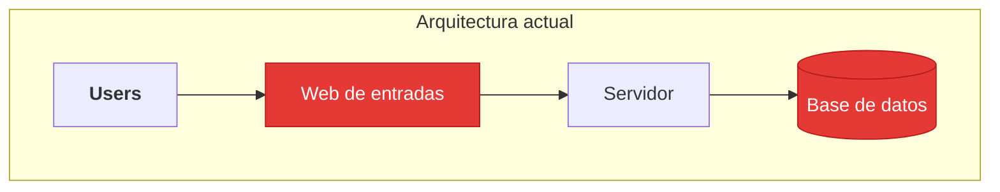
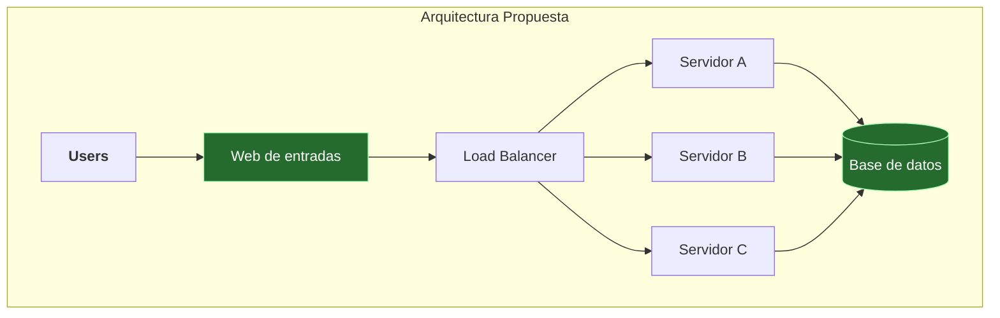

Un ejercicio típico de entrevista de **Arquitectura de software** para un perfil base, con respuestas modelo.

## Planteo del problema

Tenemos el siguiente problema en nuestro sistema de ventas de entradas para conciertos. Y contamos
con el servicio de codeaseguro para poder analizar la arquitectura actual y proponer la adecuada para resolver el inconveniente.

Problemática:
El dia que se habilita la venta de entradas el sistema termina colapsando porque ingresan muchos usuarios al mismo tiempo, la aplicación se cae y nadie puede comprar.

## Arquitectura actual

## Solución propuesta

### Lo que detectamos
Analizando la arquitectura actual podemos detectar que:
- El sistema cuenta con un solo servidor que procesa toda la informacion y consulta a la base de datos.
- El sistema escaló y debe soportar concurrencia en momentos picos, ej: Cuando los usuarios ingresan todos al mismo tiempo para sacar entradas.
- Un solo servidor, implica límite de CPU, memoria y conexiones simultáneas. Cuando el tráfico lo supera, empieza a rechazar pedidos o directamente se cuelga.

> [!TIP]
> La solución para estos casos no es agregar más hardware para que el servidor sea más potente.
> El cuello de botella no es la lógica de negocio, es la cantidad de conexiones simultáneas que un solo servidor puede sostener

### Lo que proponemos
Dadas las problemáticas detecatadas en la arquitectura actual, proponemos repartir el trabajo del servidor. Aquí es donde entra la utilización de un **Load Balancer o balanceador de cargas.**

#### ¿Para que sirve un Load Balancer?
Un Load Balancer es un componente que se agrega a sistemas que deben soportar concurrencia y alta disponibilidad, sin depender de un único servidor. Su rol principal es distribuir el tráfico entrante entre varios servidores idénticos: si uno no está disponible, redirige las requests hacia otro que sí lo esté. Todos estos servidores consultan la misma base de datos compartida, ya que son réplicas de la misma aplicación y necesitan trabajar siempre sobre el mismo estado de los datos. El load balancer no solo reparte, sino que además monitorea constantemente si cada servidor está vivo, para saber a cuáles puede mandarles tráfico, a esto se lo llama health check o chequeo de salud.

#### Arquitectura propuesta
Se agrega un Load Balancer delante de las distintas réplicas de los servidores.
Cabe aclarar que las réplicas son stateless (no guardan datos propios).
Con esta arquitectura, el sistema soporta el pico de tráfico sin caerse.

