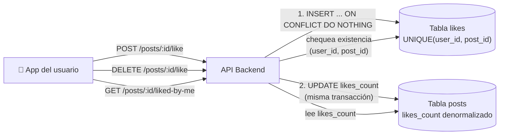

# Diseña un Sistema de "Me gusta" (Likes) — Ejercicio de Entrevista Técnica (System Design)

**Nivel:** Junior
**Tema:** Modelado de datos relacional, contadores denormalizados, idempotencia, índices

[](https://youtube.com/@codeaseguro)
[](https://instagram.com/codeaseguro)

---

## 1. Enunciado

Te piden diseñar el backend de la funcionalidad de "me gusta" de una red social simple, similar a un like de Instagram o Twitter.

**Requisitos funcionales:**

- Un usuario puede dar "me gusta" a un posteo.
- Un usuario puede quitar su "me gusta" si ya lo había dado.
- Un usuario **no puede dar dos "me gusta" al mismo posteo** (no se puede duplicar).
- Cada posteo debe mostrar cuántos "me gusta" tiene en total.
- Se debe poder saber si el usuario que está mirando el posteo ya le dio "me gusta" o no (para pintar el corazón lleno o vacío en la UI).

**Requisitos no funcionales:**

- Los posteos populares pueden tener miles o millones de likes.
- El contador de likes se muestra constantemente (en cada feed, cada vez que se lista un posteo), así que tiene que ser rápido de leer.
- Dar o sacar un like es una acción muy frecuente — el usuario puede tocar el corazón varias veces seguidas por error (doble tap, mala conexión, reintentos).

Diseñá el modelo de datos y los endpoints necesarios. Justificá tus decisiones.

### Preguntas aclaratorias que deberías hacer

1. ¿El "me gusta" es un toggle (dar/sacar con el mismo botón) o son dos acciones separadas? → Es un toggle desde la UI, pero conviene modelarlo como dos endpoints explícitos (ver más abajo, por qué).
2. ¿Hace falta un listado de "quién le dio like a este posteo"? → Sí, pero no tiene que ser instantáneo ni la prioridad principal.

---

## 2. Solución propuesta

### 2.1 Modelo de datos

La primera decisión de diseño es identificar la relación: un usuario puede likear muchos posteos, y un posteo puede recibir likes de muchos usuarios. Es una relación **muchos a muchos**, que se resuelve con una tabla intermedia.

```sql
CREATE TABLE likes (
    id          BIGINT PRIMARY KEY,
    post_id     BIGINT NOT NULL,
    user_id     BIGINT NOT NULL,
    created_at  TIMESTAMPTZ NOT NULL DEFAULT now(),

    CONSTRAINT uq_user_post_like UNIQUE (user_id, post_id)
);

CREATE INDEX idx_likes_post ON likes (post_id);
CREATE INDEX idx_likes_user ON likes (user_id);
```

**Decisión clave #1 — el constraint `UNIQUE (user_id, post_id)`** es lo que garantiza, a nivel de base de datos, que un usuario no pueda tener dos filas de like sobre el mismo posteo. No confíes solo en que el frontend deshabilite el botón después del primer click: dos requests casi simultáneos (doble tap, reintento de red) pueden llegar igual, y la base es la última línea de defensa.

### 2.2 El contador: por qué no hacer `COUNT(*)` cada vez

La respuesta ingenua para mostrar "1.204 likes" es:

```sql
-- ❌ Funciona, pero no escala
SELECT COUNT(*) FROM likes WHERE post_id = ?;
```

Con pocos likes esto es instantáneo. Pero un posteo viral con millones de filas en `likes` hace que ese `COUNT(*)` sea cada vez más lento, y el contador se muestra en *todos lados* — el feed, el perfil, cada card de posteo. No podemos pagar ese costo en cada lectura.

**Decisión clave #2 — contador denormalizado en la tabla `posts`:**

```sql
ALTER TABLE posts ADD COLUMN likes_count INT NOT NULL DEFAULT 0;
```

Cuando se crea un like, se hace `likes_count = likes_count + 1`. Cuando se borra un like, `likes_count = likes_count - 1`. Ambas operaciones ocurren en la **misma transacción** que el insert/delete en la tabla `likes`, para que nunca queden desincronizados:

```sql
BEGIN;
  INSERT INTO likes (user_id, post_id) VALUES (:user_id, :post_id);
  UPDATE posts SET likes_count = likes_count + 1 WHERE id = :post_id;
COMMIT;
```

Así, mostrar el contador es simplemente leer una columna (`SELECT likes_count FROM posts WHERE id = ?`), sin importar si el posteo tiene 3 likes o 3 millones.

### 2.3 Endpoints e idempotencia

```
POST   /posts/:id/like       → da like (idempotente)
DELETE /posts/:id/like       → saca el like (idempotente)
GET    /posts/:id/liked-by-me → true/false para el usuario actual
```

**Decisión clave #3 — hacer ambos endpoints idempotentes.** Si el usuario toca el corazón dos veces por una mala conexión y el segundo `POST /like` llega repetido, no debería fallar con un error feo ni duplicar el contador. La forma correcta de manejarlo:

```sql
INSERT INTO likes (user_id, post_id)
VALUES (:user_id, :post_id)
ON CONFLICT (user_id, post_id) DO NOTHING;
```

Si `ON CONFLICT DO NOTHING` no insertó ninguna fila (porque ya existía), **no** se incrementa `likes_count` — si no, el segundo tap sumaría un like fantasma. La lógica de la aplicación chequea cuántas filas afectó el insert antes de decidir si actualiza el contador.

### 2.4 Diagrama de arquitectura

Para este alcance no hace falta separar lectura/escritura ni cache: es un CRUD simple sobre una sola base relacional, bien indexado.



---

## 3. Preguntas de seguimiento que suele hacer el entrevistador

**¿Qué pasa si el `UPDATE` a `likes_count` falla después de que el `INSERT` en `likes` ya se hizo?**
No puede pasar de forma inconsistente porque ambas operaciones están en la misma transacción: si el `UPDATE` falla, se hace rollback del `INSERT` también. O pasan las dos, o no pasa ninguna.

**¿Por qué no calcular el contador con un `COUNT(*)` y ya, si total las bases de datos son rápidas?**
Porque "rápido" con 100 filas no es lo mismo que con 5 millones, y el contador se lee muchísimas más veces de las que se escribe un like. Es la misma idea de "no calcules en runtime lo que podés precalcular" que aparece en casi cualquier sistema con contadores (vistas, seguidores, favoritos).

**¿Cómo evitás que alguien haga un script que le dé like a un posteo 1000 veces por segundo desde la misma cuenta?**
El constraint `UNIQUE (user_id, post_id)` ya impide el duplicado exacto. Para evitar abuso a nivel de volumen de requests (spam de togglear like/unlike rapidísimo), se agregaría rate limiting en el endpoint — pero es una capa aparte, no reemplaza el constraint de la base.

**¿Este diseño escala a un posteo con 10 millones de likes?**
Sí para leer el contador (es una columna). Para listar "quién le dio like" con 10 millones de filas, ahí sí se necesitaría paginación por cursor sobre `idx_likes_post`, igual que en cualquier listado grande.

---

## 4. Checklist de una buena solución

- [ ] Relación muchos-a-muchos modelada con tabla intermedia (`likes`), no con un array o campo de texto.
- [ ] Constraint de unicidad `(user_id, post_id)` a nivel de base de datos.
- [ ] Contador denormalizado (`likes_count`) en vez de `COUNT(*)` en cada lectura.
- [ ] El insert del like y la actualización del contador ocurren en la misma transacción.
- [ ] Endpoints de like/unlike son idempotentes (`ON CONFLICT DO NOTHING` + chequeo de filas afectadas antes de tocar el contador).
- [ ] Índices sobre `post_id` y `user_id` para las consultas más comunes.
