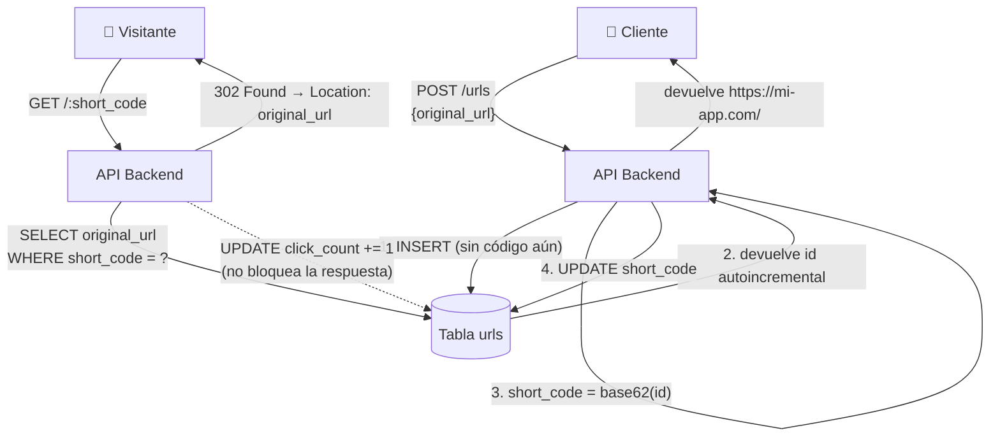

# Diseña un Acortador de URLs — Ejercicio de Entrevista Técnica (System Design)

**Nivel:** Junior
**Tema:** Generación de identificadores únicos, redirecciones HTTP, índices, contadores

---

## 1. Enunciado

Te piden diseñar el backend de un acortador de URLs, similar a bit.ly o tinyurl.

**Requisitos funcionales:**

- Un usuario manda una URL larga y el sistema le devuelve una URL corta (ej: `https://mi-app.com/aB3xZ9`).
- Cuando alguien entra a la URL corta, el sistema lo redirige a la URL original.
- El sistema debe llevar la cuenta de **cuántas veces** se usó cada link corto.
- Dos usuarios distintos que acorten la misma URL larga pueden recibir códigos cortos distintos (no hace falta deduplicar por contenido).

**Requisitos no funcionales:**

- Las redirecciones (`GET /:code`) van a ser **muchísimo más frecuentes** que la creación de links nuevos — la gente crea un link una vez y lo comparte, pero miles de personas hacen click en él.
- La redirección tiene que ser prácticamente instantánea; nadie tolera que un link tarde en abrir.
- El código corto no puede repetirse nunca entre dos URLs distintas.

Diseñá el modelo de datos, cómo generarías el código corto, y los endpoints necesarios. Justificá tus decisiones.

### Preguntas aclaratorias que deberías hacer

1. ¿El código corto lo puede elegir el usuario (un "alias" personalizado) o siempre lo genera el sistema? → Por ahora, siempre lo genera el sistema. El alias personalizado queda para una v2.
2. ¿Los links expiran en algún momento? → No para esta v1.
3. ¿Hace falta autenticación para crear links? → No es el foco del ejercicio; asumí que cualquiera puede crear uno.

---

## 2. Solución propuesta

### 2.1 Modelo de datos

```sql
CREATE TABLE urls (
    id           BIGINT PRIMARY KEY,
    short_code   VARCHAR(10) NOT NULL,
    original_url TEXT NOT NULL,
    click_count  BIGINT NOT NULL DEFAULT 0,
    created_at   TIMESTAMPTZ NOT NULL DEFAULT now(),

    CONSTRAINT uq_short_code UNIQUE (short_code)
);

CREATE INDEX idx_urls_short_code ON urls (short_code);
```

**Decisión clave #1 — el constraint `UNIQUE (short_code)`.** Es la garantía de que, pase lo que pase en la generación del código, la base de datos nunca va a permitir dos filas con el mismo código corto apuntando a URLs distintas.

### 2.2 Cómo generar el código corto

Esta es la parte central del ejercicio. Hay dos enfoques típicos:

**Opción A — hashear la URL.** Tomar un hash (MD5, SHA) de la URL original y quedarse con los primeros 6-8 caracteres. El problema: dos URLs distintas pueden generar el mismo prefijo de hash (colisión), y encima si el mismo usuario acorta la misma URL dos veces, siempre da el mismo código — lo cual va en contra del requisito de que dos acortados de la misma URL pueden tener códigos distintos.

**Opción B (recomendada) — codificar el ID autoincremental en Base62.** Cada fila nueva en `urls` ya tiene un `id` numérico único que la base garantiza sin esfuerzo extra (autoincremental o secuencia). Ese número se convierte a una cadena corta usando Base62 (`a-z`, `A-Z`, `0-9`, 62 símbolos):

```
id = 125         → short_code = "cb"
id = 1.000.000   → short_code = "4c92"
```

```python
ALPHABET = "0123456789abcdefghijklmnopqrstuvwxyzABCDEFGHIJKLMNOPQRSTUVWXYZ"

def encode_base62(num: int) -> str:
    if num == 0:
        return ALPHABET[0]
    code = []
    while num > 0:
        num, rem = divmod(num, 62)
        code.append(ALPHABET[rem])
    return "".join(reversed(code))
```

- No hay colisiones posibles: viene de un `id` que la base ya garantiza único.
- No hace falta reintentar la generación ni chequear si el código ya existe — el mapeo `id → código` es determinístico y siempre distinto porque el `id` siempre es distinto.
- Con solo 6 caracteres en Base62 ya se pueden representar más de 56 mil millones de combinaciones (62⁶), más que de sobra para el volumen de un acortador típico.

**Flujo completo al crear un link:**

```sql
-- 1. Insertar la URL sin el short_code todavía (o con un valor temporal)
INSERT INTO urls (original_url) VALUES (:original_url) RETURNING id;

-- 2. En la aplicación: short_code = encode_base62(id)

-- 3. Actualizar la fila con el código ya calculado
UPDATE urls SET short_code = :short_code WHERE id = :id;
```

### 2.3 Endpoints

```
POST /urls              → crea un link corto a partir de una URL larga
GET  /:short_code        → redirige (HTTP 301/302) a la URL original
GET  /urls/:short_code/stats → devuelve click_count y metadata
```

**Decisión clave #2 — usar redirect 301 vs 302.** Un `301 Moved Permanently` le dice al navegador "podés cachear esta redirección y no volver a preguntarme". Eso es más rápido para el usuario, pero significa que el navegador **no vuelve a pegarle a tu servidor** en visitas futuras desde ese navegador — y entonces no podés contar ese click. Por eso, para un acortador que necesita contar clicks de forma confiable, se usa **302 Found** (redirección temporal, no cacheable), aunque sea una request extra en cada click.

**Decisión clave #3 — incrementar el contador sin frenar la redirección.** El usuario que hace click no debería notar ningún delay por el `UPDATE click_count`. Una forma simple: responder la redirección primero, y actualizar el contador en el mismo request pero después de armar la respuesta (o de forma asíncrona con una cola simple), en vez de bloquear la redirección esperando a que el `UPDATE` termine.

```sql
UPDATE urls SET click_count = click_count + 1 WHERE short_code = :code;
```

### 2.4 Diagrama de arquitectura



---

## 3. Preguntas de seguimiento que suele hacer el entrevistador

**¿Qué pasa si dos requests de creación llegan al mismo tiempo?**
No hay conflicto posible: cada `INSERT` genera su propio `id` autoincremental de forma atómica a nivel de base de datos, así que nunca dos requests reciben el mismo `id`, y por lo tanto nunca el mismo `short_code`.

**¿Por qué no generar el código corto de forma aleatoria en vez de a partir del `id`?**
Se puede, pero entonces hay que chequear contra la base si ese código aleatorio ya existe antes de guardarlo (y reintentar si colisiona), lo cual agrega una consulta extra y, en el peor caso, varios reintentos. Codificar el `id` evita ese problema por completo.

**La tabla `urls` va a crecer muchísimo. ¿Cómo hacés para que el `SELECT` en la redirección siga siendo rápido?**
El índice único sobre `short_code` (que ya existe por el propio constraint) hace que esa búsqueda sea O(log n) sin importar cuántos millones de filas tenga la tabla.

**¿Cómo escalarías las lecturas (redirecciones) si tienen 100x más tráfico que las escrituras?**
Mismo patrón que en otros sistemas con lecturas masivas: agregar una cache (Redis) del mapeo `short_code → original_url` delante de la base, ya que ese dato prácticamente nunca cambia una vez creado.

---

## 4. Checklist de una buena solución

- [ ] Constraint de unicidad en `short_code` a nivel de base de datos.
- [ ] Generación del código corto sin posibilidad de colisión (Base62 sobre un `id` único, no hash con reintentos).
- [ ] Uso correcto de status HTTP: `302` para poder seguir contando clicks, no `301`.
- [ ] El incremento del contador de clicks no bloquea ni retrasa la redirección al usuario.
- [ ] Índice sobre `short_code` para que la búsqueda en cada redirección sea rápida a cualquier escala.
- [ ] Reconoce que redirecciones (lectura) y creación de links (escritura) tienen patrones de tráfico muy distintos, y que eso habilita optimizaciones futuras (cache) sin sobre-diseñar la v1.
