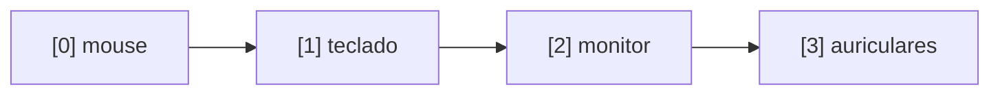
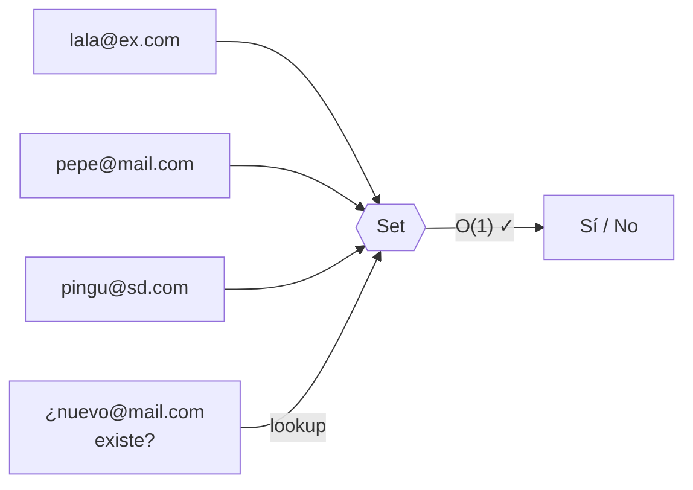
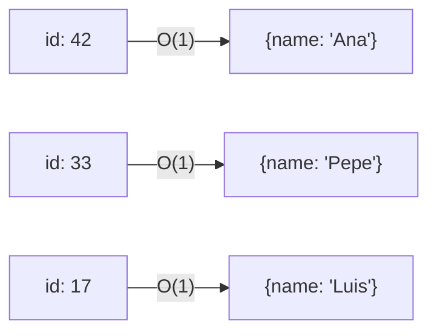
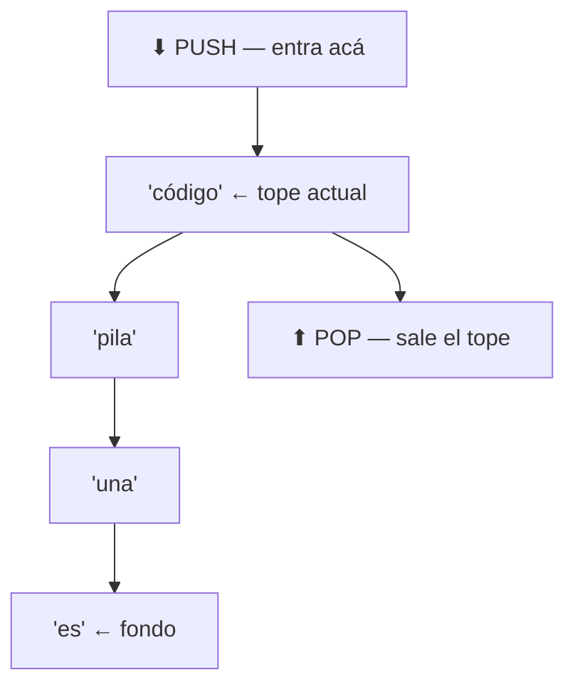
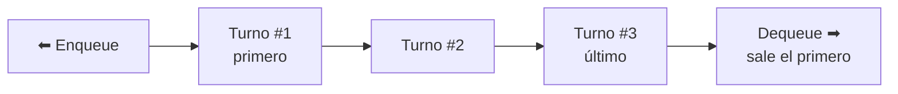
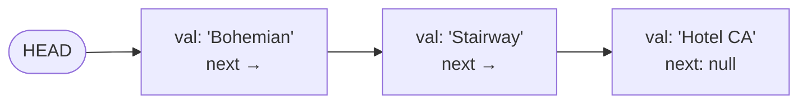
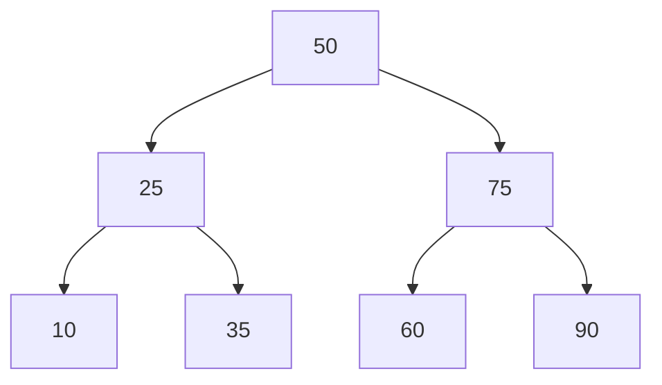
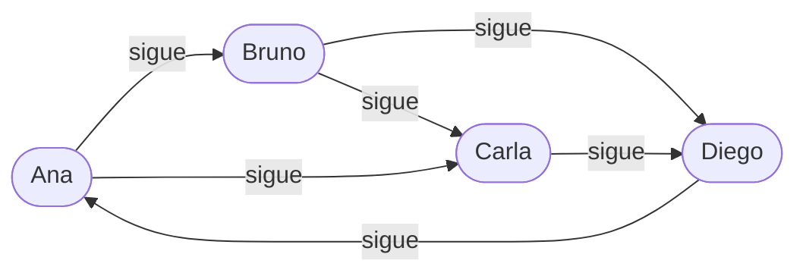

# Estructuras de Datos — Guía Práctica

> Elegí la estructura correcta para cada problema. Cada sección arranca con un caso real.

---

## Índice

- [Array / Lista](#01--array--lista)
- [Set / Conjunto](#02--set--conjunto)
- [Map / Diccionario](#03--map--diccionario)
- [Stack / Pila](#04--stack--pila)
- [Queue / Cola](#05--queue--cola)
- [Lista Enlazada](#06--lista-enlazada)
- [Árbol Binario de Búsqueda](#07--árbol-binario-de-búsqueda-bst)
- [Grafo](#08--grafo)

---

## 01 · Array / Lista

**Problema real:** Necesito guardar los productos de un carrito en el orden que se agreguen y acceder al 3er elemento directo, sin recorrerlo todo.

**¿Qué es?** Una colección ordenada de elementos accesibles por índice. El más básico y el más usado.

### Complejidad

| Acceso | Búsqueda | Inserción | Eliminación |
|--------|----------|-----------|-------------|
| O(1) ✅ | O(n) ⚠️ | O(n) ⚠️ | O(n) ⚠️ |

> Rapidísimo para acceder por posición. Lento para buscar un valor específico porque hay que recorrerlo.

### Cuándo usarlo
- Necesitás mantener el **orden de inserción** y acceder por índice
- Iterás todos los elementos secuencialmente
- El tamaño es conocido o cambia poco

---

## 02 · Set / Conjunto

**Problema real:** Tengo 10.000 emails registrados. Necesito saber al instante si uno ya existe, sin recorrer todos.

**¿Qué es?** Una colección sin duplicados donde la pregunta `¿existe?` es casi instantánea sin importar el tamaño.

### Complejidad

| Acceso | Búsqueda | Inserción | Eliminación |
|--------|----------|-----------|-------------|
| — | O(1) ✅ | O(1) ✅ | O(1) ✅ |

### Cuándo usarlo
- Necesitás saber si algo **existe** sin importar el orden
- Querés eliminar duplicados de una colección
- Operaciones de intersección, unión o diferencia entre colecciones

---

## 03 · Map / Diccionario

**Problema real:** Tengo el ID de un usuario. Necesito sus datos completos, ya, sin recorrer nada.

**¿Qué es?** Una colección de pares clave → valor. La clave apunta directo al dato. Sin búsqueda, sin recorrido.

### Complejidad

| Acceso | Búsqueda | Inserción | Eliminación |
|--------|----------|-----------|-------------|
| O(1) ✅ | O(1) ✅ | O(1) ✅ | O(1) ✅ |

### Cuándo usarlo
- Asociar una **clave única** a datos complejos (caché, sesiones, índices)
- Contar frecuencia de elementos en O(1) por elemento
- Lookups rápidos por cualquier tipo de identificador

---

## 04 · Stack / Pila

**Problema real:** El botón "deshacer" de un editor — el **último cambio** que hiciste tiene que ser el primero en deshacerse.

> ⚠️ Un Stack es **LIFO** (Last In, First Out).

**¿Qué es?** Una colección donde solo podés operar sobre el elemento del tope. El último en entrar es el primero en salir.

### Complejidad

| Acceso | Búsqueda | Push | Pop |
|--------|----------|------|-----|
| O(n) ⚠️ | O(n) ⚠️ | O(1) ✅ | O(1) ✅ |

### Cuándo usarlo
- Historial de acciones que se deshacen en orden inverso (undo/redo)
- Validación de paréntesis y delimitadores balanceados
- El botón "atrás" del navegador — también el call stack del runtime

---

## 05 · Queue / Cola

**Problema real:** Un sistema de turnos — el primero que llegó tiene que ser el primero en ser atendido.

**¿Qué es?** Lo opuesto al Stack. FIFO: First In, First Out. El primero en entrar es el primero en salir.

### Complejidad

| Acceso | Búsqueda | Enqueue | Dequeue |
|--------|----------|---------|---------|
| O(n) ⚠️ | O(n) ⚠️ | O(1) ✅ | O(1) ✅ |

### Cuándo usarlo
- Sistemas de mensajería y colas de tareas (RabbitMQ, SQS, Kafka)
- BFS (Breadth-First Search) en grafos y árboles
- Rate limiting: atender requests en el orden en que llegaron

---

## 06 · Lista Enlazada

**Problema real:** Una playlist que se edita constantemente — agrego canciones al medio, las reordeno, las elimino. Con un Array cada inserción desplaza todos los elementos.

**¿Qué es?** Nodos que se apuntan entre sí. Insertar o eliminar solo requiere cambiar punteros — sin mover memoria.

### Complejidad

| Acceso | Búsqueda | Inserción | Eliminación |
|--------|----------|-----------|-------------|
| O(n) ⚠️ | O(n) ⚠️ | O(1) ✅ | O(1) ✅ |

> La inserción/eliminación es O(1) **si ya tenés el puntero al nodo**. Llegar al nodo sigue siendo O(n).

### Cuándo usarlo
- Muchas inserciones y eliminaciones en posiciones arbitrarias
- Implementar Stack o Queue con tamaño dinámico
- Cuando no necesitás acceso aleatorio por índice

---

## 07 · Árbol Binario de Búsqueda (BST)

**Problema real:** Necesito buscar, insertar y eliminar valores manteniendo todo ordenado. Con un Array ordenado insertar es O(n) — no escala.

**¿Qué es?** Árbol donde cada nodo cumple: **izquierda < nodo < derecha**. Permite búsqueda binaria manteniendo los datos dinámicos.

### Complejidad (árbol balanceado)

| Acceso | Búsqueda | Inserción | Eliminación |
|--------|----------|-----------|-------------|
| O(log n) ✅ | O(log n) ✅ | O(log n) ✅ | O(log n) ✅ |

> Si el árbol se desbalancea (insertar datos ya ordenados) degenera en O(n). Para evitarlo: AVL o Red-Black Tree.

### Cuándo usarlo
- Datos que necesitan estar ordenados y se modifican frecuentemente
- Búsquedas por rango (usuarios entre edad 20 y 30)
- Autocompletado — y es la base de los índices en bases de datos

---

## 08 · Grafo

**Problema real:** Modelar las conexiones entre usuarios en una red social — quién sigue a quién. Los árboles son jerárquicos; acá cualquier nodo puede conectarse con cualquiera.

**¿Qué es?** Nodos (vértices) conectados por aristas (edges). Puede ser dirigido o no, ponderado o no. La estructura más general de todas.

### Complejidad (lista de adyacencia)

| Agregar nodo | Agregar arista | BFS / DFS | Espacio |
|--------------|----------------|-----------|---------|
| O(1) ✅ | O(1) ✅ | O(V+E) ⚠️ | O(V+E) |

### Cuándo usarlo
- Redes sociales, mapas, sistemas de recomendación
- Rutas y caminos más cortos — Dijkstra, A* (GPS, logística)
- Detección de dependencias circulares en módulos o microservicios

---

## Resumen comparativo

| Estructura | Acceso | Búsqueda | Inserción | Eliminación | Caso de uso principal |
|------------|--------|----------|-----------|-------------|----------------------|
| Array | O(1) | O(n) | O(n) | O(n) | Lista ordenada por índice |
| Set | — | O(1) | O(1) | O(1) | Existencia única, sin duplicados |
| Map | O(1) | O(1) | O(1) | O(1) | Clave → Valor, lookups rápidos |
| Stack | O(n) | O(n) | O(1) | O(1) | LIFO — undo, call stack |
| Queue | O(n) | O(n) | O(1) | O(1) | FIFO — turnos, mensajería |
| Lista Enlazada | O(n) | O(n) | O(1) | O(1) | Inserciones frecuentes al medio |
| BST | O(log n) | O(log n) | O(log n) | O(log n) | Datos ordenados y dinámicos |
| Grafo | — | O(V+E) | O(1) | O(V+E) | Relaciones entre entidades |

---

*Codea Seguro*
