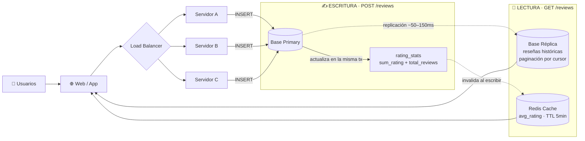

# Diseña un Sistema de Reseñas — Ejercicio de Entrevista Técnica (System Design)

**Nivel:** Mid 
**Tema:** Modelado de datos, separación lectura/escritura, cache, tradeoffs de consistencia

---

## 1. Enunciado

Te piden diseñar el backend de un sistema de reseñas de productos, similar al que verías en Mercado Libre, Amazon o Google Maps.

**Requisitos funcionales:**

- Un usuario puede dejar una reseña sobre un producto: puntaje de 1 a 5 estrellas + comentario de texto.
- Un usuario **no puede dejar más de una reseña por producto**.
- Cualquier visitante puede ver las reseñas de un producto, ordenadas de la más reciente a la más antigua.
- El listado de productos debe mostrar el **rating promedio** de cada uno (ej: "4.3 ★ · 1.204 reseñas").

**Requisitos no funcionales:**

- El sistema tiene ~100.000 productos y recibe **muchas más lecturas que escrituras** (leer reseñas es masivo; escribir una reseña es un evento puntual por usuario).
- Un producto puede tener decenas de miles de reseñas.
- El cálculo del rating promedio no puede degradar el tiempo de respuesta del listado de productos.

Diseñá el modelo de datos y la arquitectura de la solución. Justificá tus decisiones.

### Preguntas aclaratorias que deberías hacer (y que el entrevistador espera)

1. ¿Es aceptable que, justo después de publicar una reseña, el usuario no la vea reflejada de inmediato en el promedio? → **Sí, es aceptable.** (Esta respuesta es la que habilita todo el diseño de abajo. Si la respuesta fuera "no", la arquitectura cambia por completo — ver la nota al final.)
2. ¿Se pueden editar o borrar reseñas? → Sí, con soft-delete.

---

## 2. Solución propuesta

### 2.1 Modelo de datos

```sql
CREATE TABLE reviews (
    id          BIGINT PRIMARY KEY,
    product_id  BIGINT NOT NULL,
    user_id     BIGINT NOT NULL,
    rating      SMALLINT NOT NULL CHECK (rating BETWEEN 1 AND 5),
    comment     TEXT,
    created_at  TIMESTAMPTZ NOT NULL DEFAULT now(),
    updated_at  TIMESTAMPTZ NOT NULL DEFAULT now(),
    deleted_at  TIMESTAMPTZ NULL,

    CONSTRAINT uq_user_product UNIQUE (user_id, product_id)
);

CREATE INDEX idx_reviews_product_created
    ON reviews (product_id, created_at DESC);

CREATE INDEX idx_reviews_user_created
    ON reviews (user_id, created_at DESC);
```

**Decisión clave #1 — el constraint `UNIQUE (user_id, product_id)`** es lo que impide que un usuario o boot deje 50 reseñas de 5 estrellas del mismo producto. Se resuelve a nivel de base de datos, no en código de aplicación (que puede fallar bajo concurrencia).

**Decisión clave #2 — nunca calcules el promedio en runtime.** La respuesta ingenua es:

```sql
-- ❌ No hagas esto en producción
SELECT AVG(rating) FROM reviews WHERE product_id = ?;
```

Esto funciona para 10 reseñas. Con 100.000 productos y decenas de miles de reseñas por producto, cada carga del listado dispara ese cálculo en paralelo miles de veces. La solución es una tabla de estadísticas **precalculadas**:

```sql
CREATE TABLE rating_stats (
    product_id     BIGINT PRIMARY KEY,
    sum_rating     BIGINT NOT NULL DEFAULT 0,
    total_reviews  INT NOT NULL DEFAULT 0,
    dist_1         INT NOT NULL DEFAULT 0,
    dist_2         INT NOT NULL DEFAULT 0,
    dist_3         INT NOT NULL DEFAULT 0,
    dist_4         INT NOT NULL DEFAULT 0,
    dist_5         INT NOT NULL DEFAULT 0,
    updated_at     TIMESTAMPTZ NOT NULL DEFAULT now()
);
-- avg_rating se deriva: sum_rating / total_reviews
```

Se guarda la **suma acumulada** (no el promedio directamente) para poder recalcular sin releer las filas individuales cuando se agrega o elimina una reseña. Esta tabla se actualiza en la misma transacción que el `INSERT` de la reseña.

### 2.2 Arquitectura: separar lectura y escritura

Las escrituras (`POST /reviews`) son poco frecuentes. Las lecturas (`GET /reviews`, ver el rating en el listado) son masivas. Meter ambas en la misma base compite por los mismos recursos: un pico de escrituras frena las lecturas, y viceversa.

**Solución:** las escrituras van a una base **Primary**; las lecturas van a una **Réplica** de solo lectura, sincronizada automáticamente desde la Primary. El rating promedio, además, se cachea en Redis para no pegarle a ninguna de las dos bases en cada request del listado.



**Decisión clave #3 — paginación por cursor, no `OFFSET`.** Con `OFFSET 10000` la base tiene que leer y descartar 10.000 filas antes de devolver la página. Se pagina con `(created_at, id)` como cursor: cada página siguiente arranca justo después del último elemento visto, sin importar cuántas páginas ya se recorrieron.

### 2.3 El tradeoff: consistencia eventual

Entre la Primary y la Réplica hay un delay de replicación, típicamente 50–150ms. Si un usuario escribe una reseña y hace un `GET` en ese mismo instante, puede que la réplica todavía no la tenga. Esto es **consistencia eventual**: el sistema converge a la data correcta, pero no instantáneamente.

> Para reseñas esto es un tradeoff aceptable — nadie necesita ver su propia reseña reflejada al milisegundo. Documentarlo explícitamente evita que un QA lo reporte como bug cuando en realidad es una decisión de diseño.

**Este es el punto que un buen candidato debe verbalizar en la entrevista:** *"Elegí consistencia eventual acá a propósito, porque el costo de un pequeño delay es mucho menor que el costo de acoplar lecturas masivas a la misma base que recibe las escrituras."*

---

## 3. Preguntas de seguimiento que suele hacer el entrevistador

**¿Qué pasa si Redis cae?**
El sistema debe degradar con gracia: si la cache no responde, se lee `rating_stats` directo de la réplica (sigue siendo O(1), no hay `AVG()` sobre `reviews`). El fallo de un componente de cache nunca debería tirar abajo la feature completa.

**¿Cómo evitás perder la actualización de `rating_stats` si el insert de la reseña falla a mitad de camino?**
El `INSERT` en `reviews` y el `UPDATE` en `rating_stats` ocurren dentro de la misma transacción de base de datos. O pasan los dos, o no pasa ninguno.

**¿Cómo escalarías esto a 10x el tráfico de lectura?**
Múltiples réplicas de lectura detrás de un balanceador de lecturas, y subir el TTL de la cache si el negocio tolera un promedio un poco más desactualizado.

**¿Y si el requisito fuera que el usuario SÍ tiene que ver su reseña al instante?**
Ahí cambia la respuesta a la pregunta aclaratoria inicial, y con eso cambia todo el diseño: se necesitaría **consistencia fuerte** para esa lectura puntual — por ejemplo, leer directo de la Primary solo para el propio usuario recién después de escribir (patrón *read-your-writes*), mientras el resto de los visitantes sigue leyendo de la réplica. Es un buen ejemplo de por qué la primera pregunta aclaratoria del enunciado no es un detalle menor: define la arquitectura completa.

---

## 4. Checklist de una buena solución

- [ ] Constraint de unicidad `(user_id, product_id)` a nivel de base de datos, no solo en código de aplicación.
- [ ] Rating promedio precalculado, nunca `AVG()` en runtime sobre la tabla completa.
- [ ] Paginación por cursor en vez de `OFFSET`.
- [ ] Separación de lectura/escritura justificada por el patrón de tráfico (muchas más lecturas que escrituras).
- [ ] Consistencia eventual identificada, justificada y documentada explícitamente — no descubierta como bug en QA.
- [ ] Cache con invalidación activa al escribir, no solo TTL pasivo.
- [ ] Soft-delete (`deleted_at`) en vez de `DELETE` físico, para auditoría.
